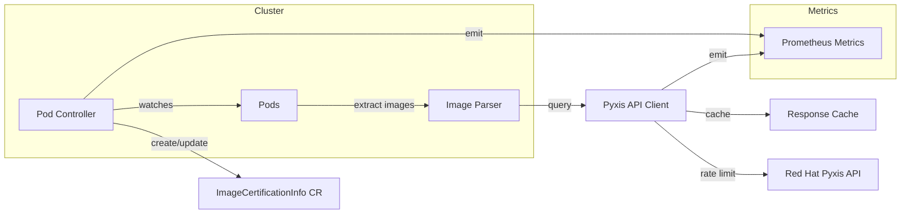

# ImageCertInfo Operator for OpenShift


[](https://goreportcard.com/report/github.com/sebrandon1/imagecertinfo-operator)


Automatically discover, inventory, and track Red Hat certified container images
across your OpenShift or Kubernetes cluster.

## Overview

The ImageCertInfo Operator is a Kubernetes operator that watches all running
containers in your cluster and creates a comprehensive, always-current inventory
of container images. It enriches this inventory with Red Hat certification data,
security vulnerabilities, and image lifecycle information from the Pyxis API.

**Perfect for organizations that require certified container images or need to
track which workloads are using vulnerable, uncertified, or end-of-life images.**

## Key Features

- **Automatic Discovery**: Watches pods cluster-wide and discovers all container images
- **Red Hat Certification**: Queries Red Hat's Pyxis API for certification status
- **Security Tracking**: Collects vulnerability counts (Critical/Important/Moderate/Low), CVE lists, and health grades (A-F)
- **Workload Mapping**: Tracks which pods use each image across all namespaces
- **Lifecycle Awareness**: Monitors EOL dates, release categories, and replacement images
- **Multi-Architecture Support**: Tracks supported architectures (amd64, arm64, s390x, ppc64le)
- **Zero Configuration**: Works without authentication for public Pyxis API access

## Architecture



**Flow:**
1. **Pod Controller** watches all pods cluster-wide for create/update/delete events
2. **Image Parser** extracts and normalizes container image references from pod specs
3. **Pyxis Client** queries Red Hat's Pyxis API with caching and rate limiting
4. **ImageCertificationInfo CR** is created/updated with certification data and pod references
5. **Metrics** are emitted for monitoring via Prometheus

## How It Differs from Red Hat ACS

| Capability | ImageCertInfo Operator | Red Hat ACS |
|------------|------------------------|-------------|
| **Primary Focus** | Image certification & inventory | Full security platform |
| **Deployment Model** | Lightweight operator (~50MB) | Multi-component platform (Central, Scanner, Sensor) |
| **Scope** | Image metadata & certification | Vulnerability scanning, policy enforcement, runtime protection |
| **Red Hat Integration** | Deep Pyxis API integration for certification data | Broader security scanning with Scanner V4/ClairCore |
| **Resource Usage** | Minimal (single pod) | Significant (multiple components, database) |
| **Policy Enforcement** | Observational only (no blocking) | Active enforcement via admission control |
| **Cost** | Free/Open Source | Commercial product |
| **Use Case** | Compliance tracking, image inventory | Enterprise container security |

**When to use ImageCertInfo Operator:**
- You need lightweight image certification tracking
- You want to audit Red Hat certified vs. non-certified images
- You need a simple inventory of all images in your cluster
- You want to track image lifecycle (EOL dates, deprecations)

**When to use Red Hat ACS:**
- You need comprehensive vulnerability scanning
- You require policy enforcement and admission control
- You need runtime threat detection
- You want CI/CD pipeline integration for security gates

## Quick Start

### Deploy the Operator

```bash
# Using the pre-built image
kubectl apply -f https://raw.githubusercontent.com/sebrandon1/imagecertinfo-operator/main/dist/install.yaml
```

### Or build and deploy from source

```bash
# Build and push to your registry
make docker-build docker-push IMG=quay.io/bapalm/imagecertinfo-operator:latest

# Install CRDs and deploy
make install
make deploy IMG=quay.io/bapalm/imagecertinfo-operator:latest
```

## OpenShift Installation

### Using oc CLI

```bash
# Apply the installation manifest
oc apply -f https://raw.githubusercontent.com/sebrandon1/imagecertinfo-operator/main/dist/install.yaml

# Verify deployment
oc get pods -n imagecertinfo-operator-system
```

### SecurityContextConstraints

The operator runs with minimal privileges. If your cluster has restrictive SCCs,
the default `restricted` SCC should work. For clusters requiring explicit SCC
assignment:

```bash
# The operator uses the default service account
oc adm policy add-scc-to-user restricted -z imagecertinfo-controller-manager -n imagecertinfo-operator-system
```

### OpenShift Monitoring Integration

To enable metrics scraping with OpenShift's built-in monitoring:

```yaml
apiVersion: monitoring.coreos.com/v1
kind: ServiceMonitor
metadata:
  name: imagecertinfo-operator
  namespace: imagecertinfo-operator-system
spec:
  endpoints:
  - port: https
    scheme: https
    tlsConfig:
      insecureSkipVerify: true
  selector:
    matchLabels:
      control-plane: controller-manager
```

## Usage Examples

Once deployed, the operator automatically creates `ImageCertificationInfo` resources for each unique image in your cluster.

### View All Tracked Images

```bash
kubectl get imagecertificationinfo

# Example output:
# NAME                                              REGISTRY              TYPE     CERTIFIED   HEALTH   AGE
# registry.redhat.io.ubi9.ubi.a1b2c3d4              registry.redhat.io    RedHat   Certified   A        5m
# quay.io.sebrandon1.imagecertinfo-operator.e5f6    quay.io               Partner  Unknown     -        5m
# docker.io.library.nginx.7g8h9i0j                  docker.io             Community NotCertified -      5m
```

### View Detailed Image Information

```bash
kubectl describe imagecertificationinfo registry.redhat.io.ubi9.ubi.a1b2c3d4
```

**Example output:**
```yaml
Name:         registry.redhat.io.ubi9.ubi.a1b2c3d4
API Version:  security.telco.openshift.io/v1alpha1
Kind:         ImageCertificationInfo
Spec:
  Full Image Reference:  registry.redhat.io/ubi9/ubi@sha256:a1b2c3d4...
  Image Digest:          sha256:a1b2c3d4...
  Registry:              registry.redhat.io
  Repository:            ubi9/ubi
Status:
  Certification Status:  Certified
  Registry Type:         RedHat
  Pyxis Data:
    Architectures:
      - amd64
      - arm64
      - ppc64le
      - s390x
    Auto Rebuild Enabled:    true
    Catalog URL:             https://catalog.redhat.com/software/containers/ubi9/ubi/...
    Compressed Size Bytes:   82945123
    Health Index:            A
    Publisher:               Red Hat, Inc.
    Release Category:        Generally Available
    Vulnerabilities:
      Critical:   0
      Important:  2
      Low:        15
      Moderate:   5
  Pod References:
    - Container:  ubi-container
      Name:       my-app-pod
      Namespace:  default
```

### Find Images with Vulnerabilities

```bash
# Find images with critical vulnerabilities
kubectl get imagecertificationinfo -o json | jq '.items[] | select(.status.pyxisData.vulnerabilities.critical > 0) | .metadata.name'
```

### Find Non-Certified Images

```bash
kubectl get imagecertificationinfo --field-selector=status.certificationStatus=NotCertified
```

### Check for Deprecated Images

```bash
kubectl get imagecertificationinfo -o wide | grep -i deprecated
```

## Container Image

The operator is available as a multi-architecture container image:

```
quay.io/bapalm/imagecertinfo-operator:latest
quay.io/bapalm/imagecertinfo-operator:stable
quay.io/bapalm/imagecertinfo-operator:v0.1.0
```

**Supported architectures:** `amd64`, `arm64`, `s390x`, `ppc64le`

## Prerequisites

- Kubernetes v1.11.3+ or OpenShift 4.x
- kubectl or oc CLI
- Cluster-admin privileges (for CRD installation)

## Configuration

The operator can be configured via command-line flags:

| Flag | Description | Default |
|------|-------------|---------|
| `--pyxis-enabled` | Enable Red Hat Pyxis API integration | `true` |
| `--pyxis-api-key` | Optional API key for higher rate limits | (none) |
| `--pyxis-refresh-interval` | Interval for periodic refresh of Pyxis certification data (0 to disable) | `24h` |
| `--pyxis-cache-ttl` | TTL for cached Pyxis API responses | `1h` |
| `--pyxis-rate-limit` | Rate limit for Pyxis API requests per second | `10` |
| `--pyxis-rate-burst` | Burst size for Pyxis API rate limiting | `20` |
| `--cleanup-interval` | Interval for cleaning up stale pod references | `5m` |
| `--metrics-bind-address` | Address for metrics endpoint | `0` |
| `--health-probe-bind-address` | Address for health probes | `:8081` |
| `--leader-elect` | Enable leader election for HA | `false` |

## Prometheus Metrics

The operator exposes metrics at the `/metrics` endpoint. All metrics use the `imagecertinfo_` prefix.

### Image Inventory Metrics

| Metric | Type | Labels | Description |
|--------|------|--------|-------------|
| `imagecertinfo_images_total` | Gauge | `status` | Total images tracked by certification status |
| `imagecertinfo_images_by_health` | Gauge | `grade` | Images by health grade (A-F) |
| `imagecertinfo_vulnerabilities_total` | Gauge | `severity` | Total vulnerabilities by severity |
| `imagecertinfo_images_eol_within_days` | Gauge | `days` | Images approaching end-of-life |
| `imagecertinfo_images_past_eol` | Gauge | - | Images past their EOL date |

### Pyxis API Metrics

| Metric | Type | Labels | Description |
|--------|------|--------|-------------|
| `imagecertinfo_pyxis_requests_total` | Counter | `status`, `endpoint` | Total Pyxis API requests |
| `imagecertinfo_pyxis_request_duration_seconds` | Histogram | `endpoint` | Request duration in seconds |
| `imagecertinfo_pyxis_cache_hits_total` | Counter | `result` | Cache hits (`hit`) and misses (`miss`) |

### Reconciliation Metrics

| Metric | Type | Labels | Description |
|--------|------|--------|-------------|
| `imagecertinfo_reconcile_total` | Counter | `result` | Reconciliation attempts (success/error/requeue) |
| `imagecertinfo_reconcile_duration_seconds` | Histogram | `controller` | Reconciliation duration |
| `imagecertinfo_images_discovered_total` | Counter | - | New images discovered |

### Event Metrics

| Metric | Type | Labels | Description |
|--------|------|--------|-------------|
| `imagecertinfo_events_emitted_total` | Counter | `type`, `reason` | Kubernetes events emitted |

### Refresh Cycle Metrics

| Metric | Type | Labels | Description |
|--------|------|--------|-------------|
| `imagecertinfo_refresh_cycles_total` | Counter | - | Completed refresh cycles |
| `imagecertinfo_refresh_duration_seconds` | Histogram | - | Refresh cycle duration |
| `imagecertinfo_images_refreshed_total` | Counter | - | Individual images refreshed |
| `imagecertinfo_certification_status_changes_total` | Counter | `from`, `to` | Certification status changes |

### Example PromQL Queries

```promql
# Percentage of certified images
sum(imagecertinfo_images_total{status="Certified"}) / sum(imagecertinfo_images_total) * 100

# Images with critical vulnerabilities
imagecertinfo_vulnerabilities_total{severity="critical"}

# Pyxis API cache hit rate
sum(rate(imagecertinfo_pyxis_cache_hits_total{result="hit"}[5m])) /
sum(rate(imagecertinfo_pyxis_cache_hits_total[5m])) * 100

# Reconciliation error rate
sum(rate(imagecertinfo_reconcile_total{result="error"}[5m])) /
sum(rate(imagecertinfo_reconcile_total[5m])) * 100
```

## Troubleshooting

### Pyxis API Errors

**Symptoms:** Images show `Unknown` certification status, Pyxis-related errors in logs.

**Solutions:**
1. Check network connectivity to `catalog.redhat.com`:
   ```bash
   kubectl exec -it deploy/imagecertinfo-controller-manager -n imagecertinfo-operator-system -- curl -I https://catalog.redhat.com
   ```
2. Verify rate limiting isn't being triggered (check `imagecertinfo_pyxis_requests_total{status="429"}`)
3. Consider adding a Pyxis API key for higher rate limits via `--pyxis-api-key`

### No Images Being Discovered

**Symptoms:** No `ImageCertificationInfo` resources created.

**Solutions:**
1. Verify pods are running in the cluster:
   ```bash
   kubectl get pods --all-namespaces
   ```
2. Check controller logs for errors:
   ```bash
   kubectl logs -l control-plane=controller-manager -n imagecertinfo-operator-system
   ```
3. Ensure the operator has RBAC permissions to list pods cluster-wide

### Stale Pod References

**Symptoms:** `ImageCertificationInfo` resources list pods that no longer exist.

**Solutions:**
1. The cleanup loop runs every 5 minutes by default. Wait for the next cycle.
2. Adjust cleanup interval if needed: `--cleanup-interval=1m`
3. Check that the cleanup loop is running in logs

### Metrics Not Appearing

**Symptoms:** Prometheus scraping shows no `imagecertinfo_*` metrics.

**Solutions:**
1. Verify the metrics endpoint is enabled (`--metrics-bind-address` is not `0`):
   ```bash
   kubectl port-forward svc/imagecertinfo-controller-manager-metrics-service -n imagecertinfo-operator-system 8443:8443
   curl -k https://localhost:8443/metrics
   ```
2. Check ServiceMonitor/PodMonitor configuration matches the service labels
3. Verify Prometheus has permissions to scrape the namespace

### High Memory Usage

**Symptoms:** Operator pod OOMKilled or using excessive memory.

**Solutions:**
1. Reduce cache TTL to limit cached responses: `--pyxis-cache-ttl=30m`
2. Increase rate limiting to slow API requests: `--pyxis-rate-limit=5`
3. Check if cluster has an unusually high number of unique images

## Contributing

Contributions are welcome! Please feel free to submit issues and pull requests.

## License

Apache License 2.0 - See [LICENSE](LICENSE) for details.
