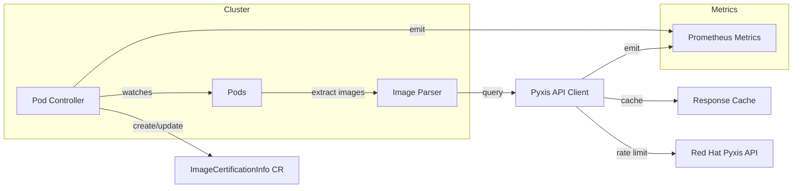

# Architecture

## Component Diagram

## Flow

1. **Pod Controller** watches all pods cluster-wide for create/update/delete events
2. **Image Parser** extracts and normalizes container image references from pod specs
3. **Pyxis Client** queries Red Hat's Pyxis API with caching and rate limiting
4. **ImageCertificationInfo CR** is created/updated with certification data and pod references
5. **Metrics** are emitted for monitoring via Prometheus

## How It Differs from Red Hat ACS

| Capability | ImageCertInfo Operator | Red Hat ACS |
|------------|------------------------|-------------|
| **Primary Focus** | Image certification & inventory | Full security platform |
| **Deployment Model** | Lightweight operator (~50MB) | Multi-component platform (Central, Scanner, Sensor) |
| **Scope** | Image metadata & certification | Vulnerability scanning, policy enforcement, runtime protection |
| **Red Hat Integration** | Deep Pyxis API integration for certification data | Broader security scanning with Scanner V4/ClairCore |
| **Resource Usage** | Minimal (single pod) | Significant (multiple components, database) |
| **Policy Enforcement** | Observational only (no blocking) | Active enforcement via admission control |
| **Cost** | Free/Open Source | Commercial product |
| **Use Case** | Compliance tracking, image inventory | Enterprise container security |

**When to use ImageCertInfo Operator:**
- You need lightweight image certification tracking
- You want to audit Red Hat certified vs. non-certified images
- You need a simple inventory of all images in your cluster
- You want to track image lifecycle (EOL dates, deprecations)

**When to use Red Hat ACS:**
- You need comprehensive vulnerability scanning
- You require policy enforcement and admission control
- You need runtime threat detection
- You want CI/CD pipeline integration for security gates

---

Next: [Configuration](configuration.md)
